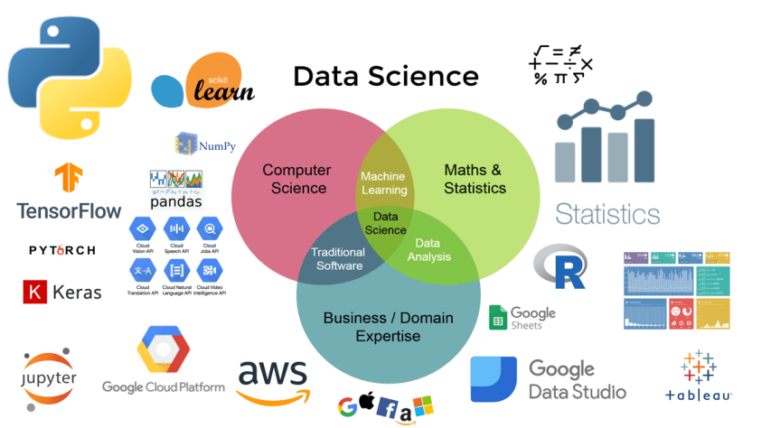

   

  

# Karinne Cristina
**Cientista de Dados Júnior**

Amante do universo Geek, fã de séries sobre hackers e ficção científica e uma Cientista de Dados que adora colocar a mão na massa desde a coleta dos dados sendo eles estruturados ou não até a construção do modelo preditivo ou descritivo. No meu dia a dia uso muito Python e SQL (esse não pode ficar nunca de fora do rolê) mas tenho um conhecimento básico de R, não sou muito boa com visualização de dados (desculpa a sinceridade, mas é verdade) então utilizo algumas ferramentas como Power BI, Data Studio, etc para lidar com esse meu gap. Recentemente tive a oportunidade de trabalhar com dados financeiros e confesso que ainda não sei muita coisa mas tenho a certeza que é esse mundo que eu quero explorar cada dia mais.

**Background in:** Python | SQL | Machine Learning | DataViz.

**Links:**
* [LinkedIn](https://www.linkedin.com/in/karinnecristinapereira/)
* [Medium](https://medium.com/@KarinneCristina)
* [Website](https://karinneristina.glitch.me/)

## Projetos que tive a oportunidade de trabalhar na [Refinaria de Dados](https://refinariadedados.com.br/):
* **Modelo de clusterização para o produto de Background Check:** O objetivo é identificar se uma pessoa ou empresa apresnta risco ao negócio.
* **Sistema de recomendação para a indústria farmacêutica:** Desenvolvimento de um modelo híbrido (filtragem colaborativa e baseada em contéudo) para recomendar medicamentos e produtos de higiene e beleza em um e-commerce.
* **Análise de sentimento para o mercado financeiro:** Analisar a correlação entre as publicações nas mídias sociais e as cotações da B3.

## Projetos pessoais:
Aqui você encontra os notebooks dos meus projetos na área de Data Science, Machine Learning e Data Analysis. 

* **Machine Learning para prever se uma pessoa recebe mais de 50K (dólares) no ano:** https://bit.ly/39edTmM
* **Extraindo insights da base de dados Black Friday através da Exploratory Data Analysis(EDA):** https://bit.ly/3aluIfz
* **Machine Learning para prever as vendas para a Black Friday:** https://bit.ly/2uQIGHm
* **Data cleaning em gêneros de filmes utilizando a biblioteca FuzzyWuzzy:** https://bit.ly/3ad24NI
* **Análise sobre praias atingidas pelas manchas de óleo no Nordeste:** https://bit.ly/38jSSpb
* **Análise sobre os Acidentes nas Rodovias Federais do Brasil no Ano de 2019:** https://bit.ly/2TeKtz5
* **Análise dos dados da Google Play Store:** https://bit.ly/2PX3wvV
* **Análise dos dados da Apple Store:** https://bit.ly/33h3aWf
---
